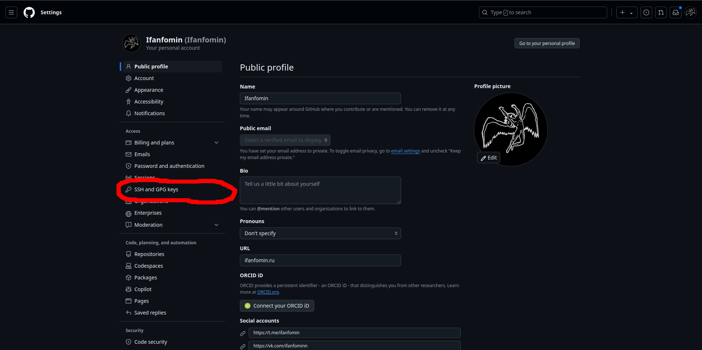
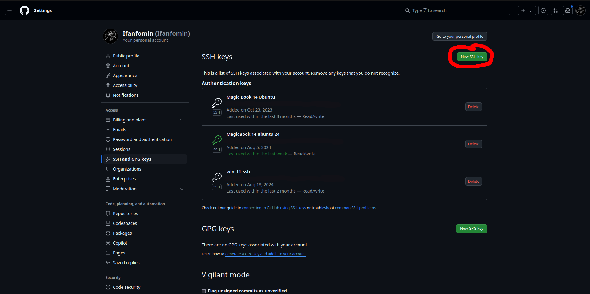
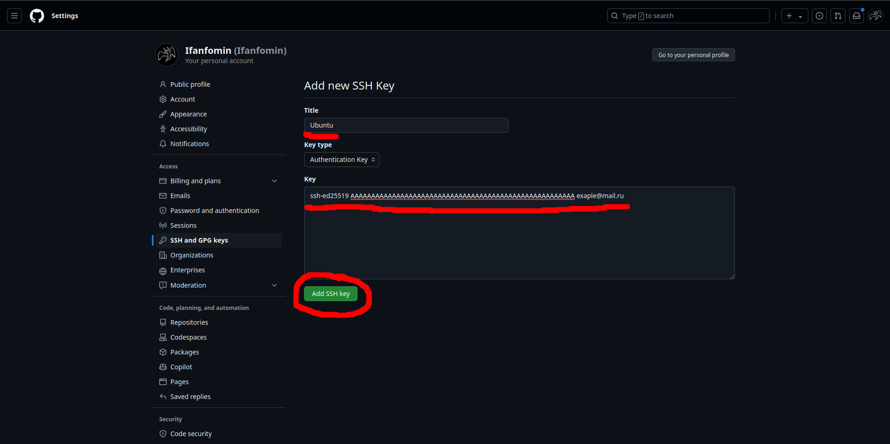
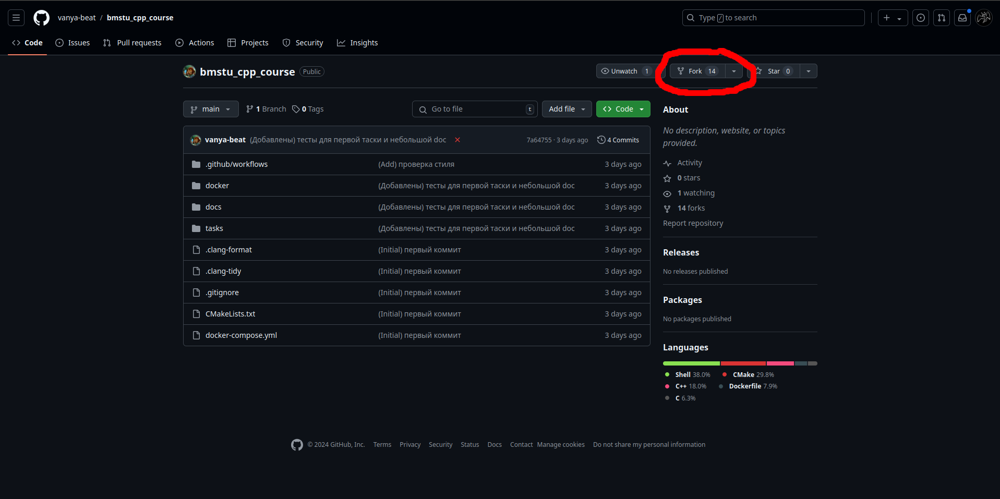
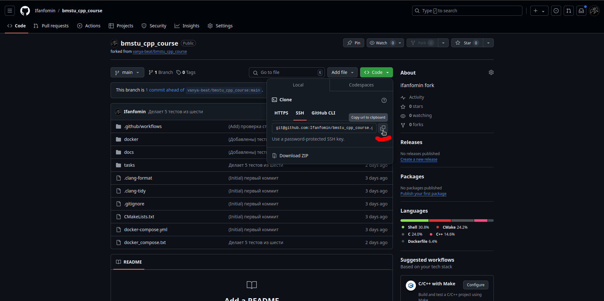
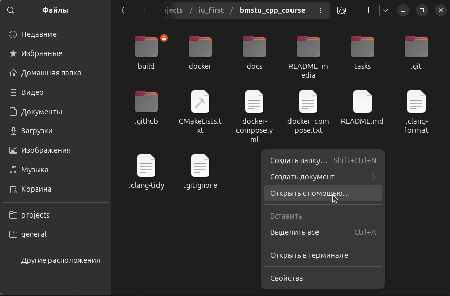

# Гайд по установке и началу работы
## Подключение Ubuntu к Github по ssh
Источник: [Ссылка на инструкцию от гитхаба](https://docs.github.com/ru/authentication/connecting-to-github-with-ssh/generating-a-new-ssh-key-and-adding-it-to-the-ssh-agent)

1. Открываете терминал на `ctrl + alt + T`
2. Вводите (создание ssh ключа на вашем ПК):
```
ssh-keygen -t ed25519 -C "ваша@почта.ru"
```
3. Просто нажимаем три раза `Enter` после следующих трёх строк:  
```
Enter a file in which to save the key (/home/YOU/.ssh/id_ALGORITHM):
Enter passphrase (empty for no passphrase):
Enter same passphrase again:
```
4. Запускаем ssh-agent (вывод будет похож на: `Agent pid 59566`):
```
eval "$(ssh-agent -s)"
```
5. Добавляем ssh ключ в ssh-agent:
```
ssh-add ~/.ssh/id_ed25519
```
6. Выполняем следущую команду и копируем всё, что она выведет, выделяя мышкой и копируя на `ctrl + shift + C`:
```
cat ~/.ssh/id_ed25519.pub
```
7. Переходим на [github.com](https://github.com) и нажимаем на иконку профиля в правом верхнем углу:  

8. Выбираем `settings`:  

9. Далее слева нажимаем на `SSH and GPG keys`:  

10. Теперь нажимаем на `New SSH key`:  

11. В `Title` вводим нашу ос (для удобства), в `Key` вставляем скопированный в 6 пункте ключ:  

12. Нажимаем `Add SSH key`
Всё, подключение между гитхабом и вашим ПК готово

## Подготовка окружения к работе
1. Делаем форк основного [репозитория](https://github.com/vanya-beat/bmstu_cpp_course):

2. Нажимаем `Create fork`:  

3. Далее нажимаем `Code`:  

4. Копируем ссылку SSH:  

5. Далее открываем терминал с помощью `ctrl + alt + T`, заходим в папку для проектов и клонируем репозиторий и переходим в него:
```
cd projects/
git clone сюда_вставляем_ссылку_из_пункта_4
cd тут_название_репозитория/
```
6. Устанавливаем докер с помощью следующей команды, т.е. копируем сразу весь код и целиком вставляем в терминал с помощью `ctrl + shift + V` и нажимаем Enter (инструкция взята с [официального сайта](https://docs.docker.com/engine/install/ubuntu/)):
```
# Add Docker's official GPG key:
sudo apt-get update
sudo apt-get install ca-certificates curl
sudo install -m 0755 -d /etc/apt/keyrings
sudo curl -fsSL https://download.docker.com/linux/ubuntu/gpg -o /etc/apt/keyrings/docker.asc
sudo chmod a+r /etc/apt/keyrings/docker.asc

# Add the repository to Apt sources:
echo \
  "deb [arch=$(dpkg --print-architecture) signed-by=/etc/apt/keyrings/docker.asc] https://download.docker.com/linux/ubuntu \
  $(. /etc/os-release && echo "$VERSION_CODENAME") stable" | \
  sudo tee /etc/apt/sources.list.d/docker.list > /dev/null
sudo apt-get update
```
7. Так же устанавливаем пакеты докера:
```
sudo apt-get install docker-ce docker-ce-cli containerd.io docker-buildx-plugin docker-compose-plugin
```
8. Теперь, находясь в папке репозитория, запускаем тесты (в первый раз будет установка всех компонентов, что займёт время), по окончанию дол:
```
sudo docker compose up --build
```
9. Открываем эту папку в VS Code (открыть с помощью и находим vs code):

10. Решаем задачу перевода строки в число в файле str2int.c по пути `tasks/task_basic_c/task_str2int/str2int.c`:  

11. После написания программы запускаем тесты этой коммандой в корне проекта, открыв для удобства терминал в vs code с помощью `~ + ctrl`:
```
sudo docker compose up --build
```
12. После прохождения всех тестов загружаем программу на гитхаб с помощью трех команд:
```
git add -A
git commit -m "Программа проходит все тесты"
git push
```
